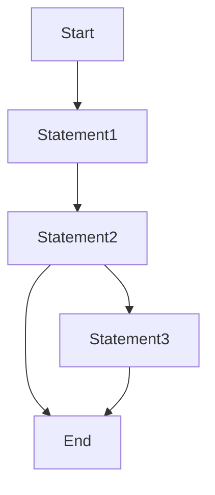

# Reserva de Salas

:bulb: Este repositório está reservado para a entrega do projeto final de Desenvolvimento Desktop

## :beginner: Informações do Projeto

- Nome do Projeto:
- Status: 
    - [x] Em progresso
    - [ ] Em revisão
    - [ ] Finalizado

## :triangular_flag_on_post: Linguagens e Frameworks

A escolha da linguagem e do framework utilizados neste projeto, dá-se pela abordagem da instituição no ensino do Desenvolvimento Desktop

- .NET
- C#
- Entity Framework Core
- WinForms

## 📈  Solução Proposta

- Requisitos:
    - [ ] Administrador cadastra salas
    - [ ] Administrador cadastra usuários
    - [ ] Administrador cadastra horários
    - [ ] Usuário comum terá acesso somente aos próprios agendamentos
    - [ ] Ambos usuários tem acesso a cadastro, alteração e deleção das reservas
    - [ ] Horários disponíveis devem estar separados por turnos
    - [ ] Se turno estiver reservado para higienização, não deve receber agendamento
    - [ ] Cancelamento não pode ser realizado pelo usuário comum com menos de um turno de antecedência
    - [ ] Agendamento deve ser realizado, no mínimo, para o dia atual

### :small_blue_diamond: Modelo Entidade Relacionamento

Através desse modelo, é possível compreender as interações entre os diferentes elementos do sistema de reserva de salas, permitindo uma melhor compreensão dos requisitos e auxiliando no desenvolvimento de uma solução eficiente e intuitiva para os usuários.

### :small_blue_diamond: Diagrama Entidade Relacionamento
Este diagrama fornece uma representação prática das entidades, atributos e relacionamentos identificados no modelo conceitual do projeto.

### :small_blue_diamond: Prototipagem
Telas contidas na aplicação.
